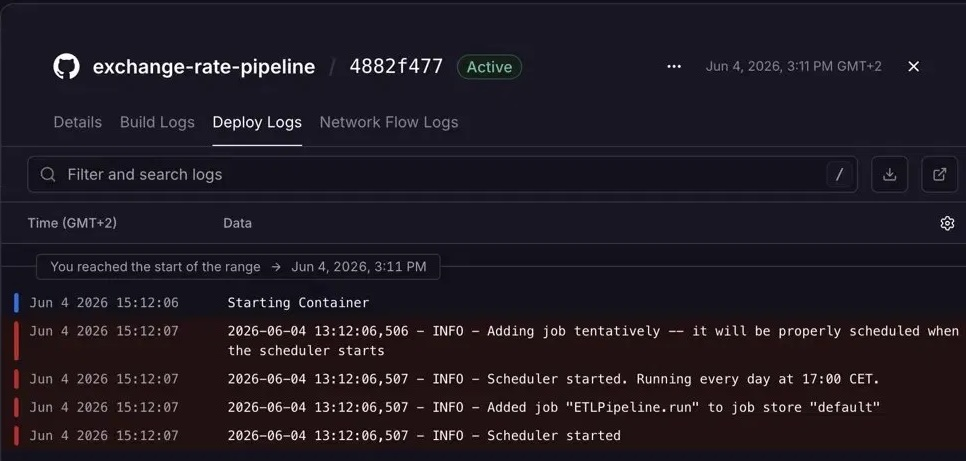

# Exchange Rate Pipeline

Automated ETL pipeline that fetches daily exchange rate data from the Frankfurter API, 
transforms it with pandas, and loads it into a PostgreSQL database. 
Runs on a schedule and deployed to the cloud.

## What it does

- Extracts daily EUR/USD, EUR/HUF, EUR/GBP and EUR/AUD exchange rates from the Frankfurter API
- Seeds the database with 2 years of historical data on first run
- Transforms raw API responses into clean, typed data using pandas
- Loads the results into a PostgreSQL database
- Runs automatically on a daily schedule using APScheduler
- Deployed to Railway (cloud)

## Tech stack

- **requests** — fetching data from the Frankfurter API
- **pandas** — transforming and cleaning the data
- **psycopg2-binary** — the PostgreSQL driver, lets Python talk to PostgreSQL
- **apscheduler** — running the pipeline on a schedule
- **python-dotenv** — loading credentials from a `.env` file safely

## Requirements

- Python 3.8+
- PostgreSQL
- See `requirements.txt` for Python dependencies

## Installation

Clone the repo:
```bash
git clone https://github.com/zoltanlederer/exchange-rate-pipeline
cd exchange-rate-pipeline
```

#### Create and activate a virtual environment:

Mac/Linux
```bash
python3 -m venv .venv
source .venv/bin/activate
```

Windows
```bash
python3 -m venv .venv
.venv\Scripts\activate
```

Install dependencies:
```bash
pip install -r requirements.txt
```

## Usage

Start the scheduler (runs the pipeline daily at 17:00 CET):
```bash
python3 scheduler.py
```

To run the pipeline manually once:
```bash
python3 pipeline.py
```

## Example output

After the first run, the database is seeded with 2 years of historical data:

| date       | base_currency | target_currency | rate    |
|------------|---------------|-----------------|---------|
| 2024-06-03 | EUR           | USD             | 1.0842  |
| 2024-06-03 | EUR           | HUF             | 391.40  |
| 2024-06-03 | EUR           | GBP             | 0.8517  |
| 2024-06-03 | EUR           | AUD             | 1.6290  |

## Deployment

Deployed to [Railway](https://railway.com). The scheduler runs continuously in the cloud, inserting new exchange rates daily.

